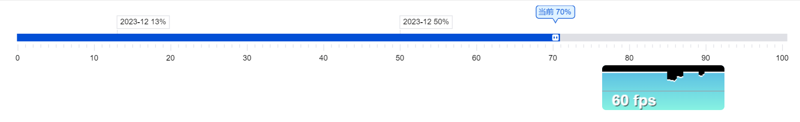

# rex-progress

canvas library para draw progress

```
npm install rex-progress --save
```

```index.html
const div = document.createElement("div");
document.body.appendChild(div);

const progress = new RexProgress(div, {
  onChange(changeValue) {
    console.log(changeValue);
  }
});

// or
progress.onChange((changeValue)=>{
  console.log(values);
})

```


